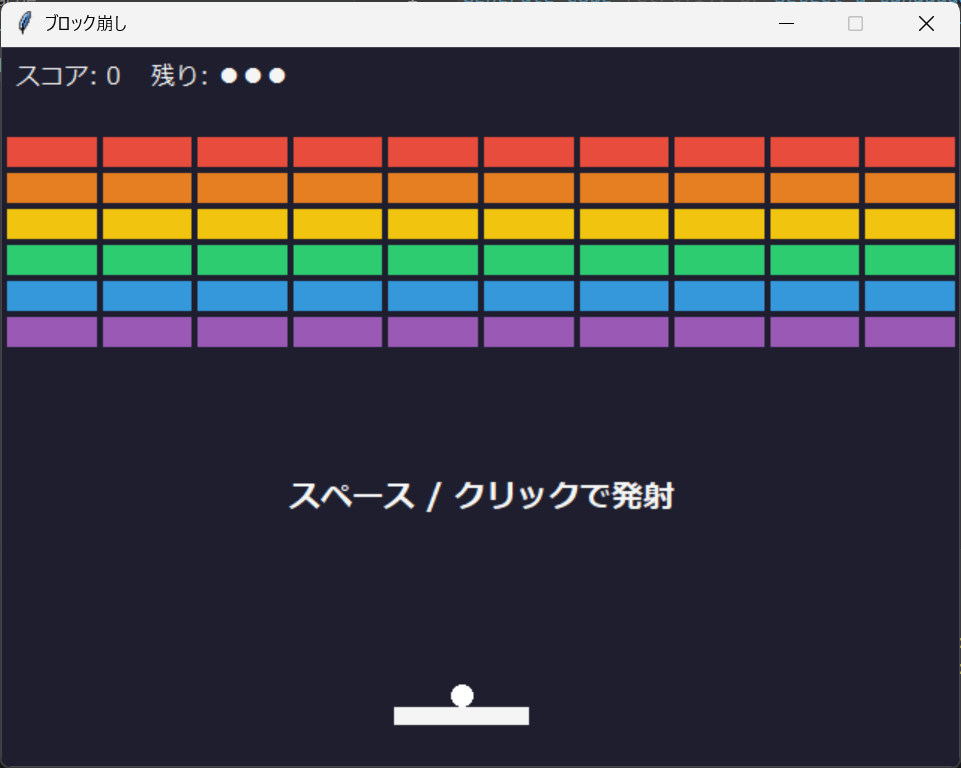

# AIエージェントでゲームを作ってみよう

AIエージェントに日本語でお願いして、Python のゲームを作るワークショップです。
プログラミングが初めてでも大丈夫です。

まずはサンプルのブロック崩しを動かし、そのあと自分のゲームをゼロから作ってみましょう。



## もくじ

1. [VS Code をインストールする](#1-vs-code-をインストールする)
2. [AIエージェントの拡張機能を入れる](#2-aiエージェントの拡張機能を入れる)
3. [Python をインストールする](#3-python-をインストールする)
4. [Git をインストールする](#4-git-をインストールする)
5. [GitHub アカウントを作る](#5-github-アカウントを作る)
6. [このリポジトリをフォークする](#6-このリポジトリをフォークする)
7. [フォークしたリポジトリをクローンする](#7-フォークしたリポジトリをクローンする)
8. [サンプルのゲームを動かす](#8-サンプルのゲームを動かす)
9. [AIエージェントでゲームを作る](#9-aiエージェントでゲームを作る)
10. [作ったゲームを記録する（add / commit / push）](#10-作ったゲームを記録するadd--commit--push)

> **このページの読み方**
> OS（Windows / Mac / Linux）ごとに手順が違うところは、見出しを分けています。自分の OS のところだけ読めばOKです。
> `このような枠` で書かれた文字は、ターミナルに入力するコマンドです。

---

## 1. VS Code をインストールする

プログラムを書いたり、AIエージェントとやりとりしたりするためのアプリ（エディタ）として、**VS Code** を入れます。

1. [VS Code の公式サイト](https://code.visualstudio.com/) を開き、「Download」から自分の OS 用をダウンロードする
2. インストールする
   - **Windows**: 途中の「追加タスクの選択」で「**PATH への追加**」にチェックが入っていることを確認
   - **Mac**: ダウンロードしたアプリを「アプリケーション」フォルダにドラッグ
   - **Linux**: `.deb`（Ubuntu など）または `.rpm`（Fedora など）をダウンロードしてインストール

---

## 2. AIエージェントの拡張機能を入れる

VS Code に「拡張機能」を追加して、AIエージェントを使えるようにします。
**使う AI によって、入れる拡張機能が変わります。** どれか1つを入れればOKです。

| 使う AI | 入れる拡張機能 | 料金 |
| --- | --- | --- |
| **Gemini**（おすすめ・基本はこれ） | **Google Antigravity** | 無料枠あり（Google アカウントが必要） |
| ChatGPT を課金している人 | **Codex** | ChatGPT の有料プラン |
| Claude を課金している人 | **Claude Code** | Claude の有料プラン |

### Gemini（Google Antigravity）を使う人

1. VS Code の左側にある「拡張機能」アイコン（四角が4つのマーク）をクリック
   （`Ctrl + Shift + X`、Mac は `Cmd + Shift + X` でも開けます）
2. 検索欄に「**Google Antigravity**」と入力し、Google 公式の拡張機能をインストール
3. 左側に出てくる Antigravity のアイコンをクリックし、Google アカウントでサインインする

> 初めて起動したときに、Antigravity が動くための部品が自動でインストールされます。少し待ちましょう。

### ChatGPT（Codex）を使う人

1. VS Code の左側にある「拡張機能」アイコンをクリック
2. 検索欄に「**Codex**」と入力し、OpenAI 公式の拡張機能をインストール
3. 左側に出てくる Codex のアイコンを開き、ChatGPT のアカウントでサインインする

### Claude（Claude Code）を使う人

1. VS Code の左側にある「拡張機能」アイコンをクリック
2. 検索欄に「**Claude Code**」と入力し、Anthropic 公式の拡張機能をインストール
3. 右上に出てくる Claude のアイコンを開き、Claude のアカウントでサインインする

---

## 3. Python をインストールする

Python はプログラミング言語です。今回のゲームは Python で書きます。

### Windows

1. [python.org のダウンロードページ](https://www.python.org/downloads/) を開き、「Download Python 3.xx」を押す
2. ダウンロードしたインストーラーを起動する
3. **最初の画面の下にある「Add python.exe to PATH」に必ずチェックを入れる**（ここが一番大事です）
4. 「Install Now」を押して完了まで待つ

### Mac

1. [python.org のダウンロードページ](https://www.python.org/downloads/) を開き、「Download Python 3.xx」を押す
2. ダウンロードした `.pkg` を開いて、画面の指示どおりにインストールする

> Homebrew（`brew install python`）で入れた Python では、ゲームの画面が出ないことがあります。python.org のインストーラーを使ってください。

### Linux（Ubuntu / Debian の場合）

Python はたいてい最初から入っています。ゲーム画面用の部品だけ追加します。

```
sudo apt install python3 python3-tk
```

### 確認する

VS Code のターミナルで確認します。VS Code のメニューから **View → Terminal**（日本語表示なら **表示 → ターミナル**）を選ぶと、画面の下にターミナルが開きます。
（このページで「ターミナルを開く」と書いてあるときは、この方法で開いてください。）

> エディタを開いたままインストールした場合は、**エディタを一度終了して開き直して**ください。

**Windows**
```
python --version
```

**Mac / Linux**
```
python3 --version
```

`Python 3.12.0` のように **3.10 以上**の数字が出ればOKです。

> **このあとのコマンドについて**
> このページでは `python` と書きますが、**Mac / Linux の人は `python3` に読み替えて**ください。

---

## 4. Git をインストールする

Git は、ファイルの変更履歴を記録するツールです。GitHub からリポジトリ（プロジェクトのフォルダ）をダウンロードするのにも使います。

### Windows

1. [Git の公式サイト](https://git-scm.com/downloads/win) からインストーラーをダウンロードする
2. インストーラーを起動する。設定がたくさん出てきますが、**すべて初期設定のまま「Next」で進めてOK** です

### Mac

ターミナルで次のコマンドを入力します。

```
git --version
```

Git が入っていなければ「コマンドライン・デベロッパ・ツールをインストールしますか？」という画面が出るので、「インストール」を押します。

### Linux（Ubuntu / Debian の場合）

```
sudo apt install git
```

### 確認と初期設定

エディタを開き直してから、ターミナルで次を入力します。

```
git --version
```

`git version 2.xx.x` のように表示されればOKです。

続けて、自分の名前とメールアドレスを登録します（GitHub アカウントと同じものがおすすめです）。

```
git config --global user.name "あなたの名前"
git config --global user.email "you@example.com"
```

---

## 5. GitHub アカウントを作る

GitHub は、プログラムをインターネット上に保存・公開できるサービスです。

1. [GitHub](https://github.com/signup) を開く
2. メールアドレス、パスワード、ユーザー名を入力してアカウントを作る
3. 届いたメールで認証を済ませる

---

## 6. このリポジトリをフォークする

「フォーク」は、このリポジトリを **自分の GitHub アカウントにまるごとコピーする** ことです。
コピーした方は自分のものなので、自由に書き換えられます。

1. GitHub にログインした状態で、[このリポジトリのページ](https://github.com/ryobi-art-club/workshop-game) を開く
2. 右上の「**Fork**」ボタンを押す
3. 「**Create fork**」を押す

`https://github.com/あなたのユーザー名/workshop-game` というページが開けば成功です。

---

## 7. フォークしたリポジトリをクローンする

「クローン」は、GitHub 上のリポジトリを **自分のパソコンにダウンロードする** ことです。

### ① 保存用のフォルダを作る

好きな場所に、`ryobi-art-club` という名前の新しいフォルダを作ります（例：デスクトップ）。

### ② URL をコピーする

フォークしたページ（`https://github.com/あなたのユーザー名/workshop-game`）で、緑色の「**Code**」ボタンを押し、表示された URL をコピーします。

### ③ VS Code でクローンする

1. VS Code で、何もフォルダを開いていない状態にする
   （フォルダを開いている場合は **File → Close Folder**、日本語表示なら **ファイル → フォルダーを閉じる**）
2. 左側の「**Source Control**」アイコン（枝分かれしたマーク、日本語表示なら「**ソース管理**」）をクリック
3. 「**Clone Repository**」（日本語表示なら「**リポジトリのクローン**」）ボタンを押す
4. 画面の上に入力欄が出るので、コピーした URL を貼り付けて `Enter`
5. 保存先を聞かれるので、① で作った `ryobi-art-club` フォルダを選ぶ
6. ダウンロードが終わると、右下に「クローンしたリポジトリを開きますか？」と出るので「**Open**」（日本語表示なら「**開く**」）を押す
7. 「このフォルダ内のファイルの作成者を信頼しますか？」と聞かれたら、「**Yes, I trust the authors**」（日本語表示なら「**はい、作成者を信頼します**」）を押す

左側のファイル一覧に `sample.py` や `README.md` が表示されれば成功です。
このあとの作業は、すべてこの `workshop-game` フォルダを開いた状態で行います。

---

## 8. サンプルのゲームを動かす

`workshop-game` フォルダを VS Code で開いた状態で、ターミナルを開き、次を入力します。

```
python sample.py
```

（Mac / Linux は `python3 sample.py`）

一番上の画像のようなウィンドウが開けば成功です 🎉

### 遊び方

| 操作 | キー |
| --- | --- |
| パドルを動かす | `←` `→` または `A` `D`（マウスでもOK） |
| ボールを発射 / 一時停止 / リトライ | スペースキー または クリック |
| ゲームを終わる | `Esc` |

### うまく動かないとき

| 症状 | 対処 |
| --- | --- |
| `python` が見つからないと言われる（Windows） | エディタを開き直す。それでもダメなら、Python のインストーラーを再度起動し「Add python.exe to PATH」にチェックを入れて入れ直す |
| `python` が見つからないと言われる（Mac / Linux） | `python3` と入力する |
| `can't open file ... sample.py` と出る | `workshop-game` フォルダを開けていません。**File → Open Folder...** で `ryobi-art-club` の中の `workshop-game` フォルダを開く |
| `No module named 'tkinter'` と出る | Mac：python.org のインストーラーで Python を入れ直す。Linux：`sudo apt install python3-tk` |
| キーを押してもパドルが動かない | ゲームのウィンドウを一度クリックしてから操作する |

---

## 9. AIエージェントでゲームを作る

ここからが本番です！ AIエージェントに「どんなゲームを作りたいか」を日本語で伝えましょう。

### GUI と tkinter について

今回作るのは **GUI（ジーユーアイ）** のゲームです。GUI とは、ウィンドウ・ボタン・図形など、**画面に表示されてマウスやキーボードで操作するもの** のことです。
（反対に、ターミナルに文字だけが表示されるものを CUI と呼びます。）

Python で GUI を作る方法はいくつかありますが、今回は **tkinter（ティーケーインター）** を使います。
tkinter は Python に最初から入っているので、**追加のインストールなしで動かせます**。サンプルのブロック崩しも tkinter で作られています。

プロンプトに「**Python の tkinter で**」と書いておくと、AI が tkinter を使ってくれます。

### AIエージェントの開き方

VS Code で、手順 2 で入れた拡張機能のアイコン（Antigravity / Codex / Claude）をクリックすると、チャット画面が開きます。そこに頼みたいことを入力します。

AIエージェントは、ファイルを作ったりコマンドを実行したりする前に「実行してもいいですか？」と聞いてくることがあります。内容を見て、問題なければ許可しましょう。

### コツ

- **最初は小さく頼む。** 一度に全部盛りにせず、まず動くものを作ってもらい、少しずつ機能を足していきます。
- **動かしてみて、気になったことをそのまま伝える。** 「ボールが速すぎる」「負けたときに何も表示されない」などで十分です。
- **エラーが出たら、エラーメッセージをそのまま貼り付ける。** 「このエラーを直してください」と添えればOKです。
- **ファイル名を指定する。** どのファイルができたか分かりやすくなります。

### プロンプト例

#### ⭕❌ OXゲーム（三目並べ）

```
Python の tkinter で、2人で遊べるOXゲーム（三目並べ）を作ってください。
3×3 のマスをクリックすると、O と X が交互に置かれます。
縦・横・斜めのどれかが3つそろったら勝ちで、勝った方を画面に表示してください。
ファイル名は ox_game.py にしてください。
```

動いたら、こんなふうに機能を足してみましょう。

```
ox_game.py で、勝った列に線を引いて、もう一度遊ぶためのリセットボタンを付けてください
```

```
ox_game.py に、コンピュータと対戦できるモードを追加してください。
コンピュータは、勝てるマスがあればそこに置き、相手が勝ちそうならそれを防ぐようにしてください
```

#### 🔴🟡 Connect 4（四目並べ）

```
Python の tkinter で、2人で遊べる Connect 4（四目並べ）を作ってください。
盤面は横7列・縦6段です。
列をクリックすると、その列の一番下の空いているところにコマが落ちます。
赤と黄色のプレイヤーが交互にコマを置き、縦・横・斜めのどれかで4つそろえたら勝ちです。
ファイル名は connect4.py にしてください。
```

```
connect4.py で、コマが上から落ちてくるアニメーションを付けてください
```

```
connect4.py に、コンピュータと対戦できるモードを追加してください
```

#### 🧱 ブロック崩し

サンプルと同じものを自分で作ってみたり、サンプルを改造したりしてみましょう。

```
Python の tkinter でブロック崩しを作ってください。
矢印キーでパドルを左右に動かし、ボールを跳ね返してブロックを壊します。
ブロックを全部壊したらクリア、ボールを3回落としたらゲームオーバーです。
ファイル名は breakout.py にしてください。
```

```
sample.py のブロック崩しに、ブロックを壊したときにたまにアイテムが落ちてくる機能を追加してください。
アイテムを取るとパドルが一定時間長くなるようにしてください
```

#### 💡 ほかにもこんなゲームが作りやすいです

- ヘビゲーム（スネークゲーム）
- もぐらたたき
- 神経衰弱（トランプの絵合わせ）
- 数当てゲーム
- シューティングゲーム（インベーダー風）

```
Python の tkinter で、〇〇ゲームを作ってください。ルールは……
```

の形で、自由に頼んでみてください！

### 作ったゲームを動かす

AIエージェントが作ったファイルも、サンプルと同じように起動できます。

```
python ox_game.py
```

（Mac / Linux は `python3 ox_game.py`）

---

## 10. 作ったゲームを記録する（add / commit / push）

ゲームができたら、Git で記録しておきましょう。
Git の記録は、作業内容の「**セーブ**」のようなものです。試行錯誤でプログラムが壊れてしまっても、セーブしたところまで戻せます。**セーブはこまめにね**。

### 用語をざっくり

| 用語 | ひとことで言うと | たとえると |
| --- | --- | --- |
| **add** | セーブしたいファイルを選ぶ | 写真を撮る前に、写したい人を並ばせる |
| **commit** | 選んだファイルの今の状態を記録する | 写真を撮ってアルバムに貼る |
| **push** | 記録を GitHub にアップロードする | アルバムをクラウドにバックアップする |

add と commit は自分のパソコンの中だけで完結します。push して初めて GitHub に反映されます。

### Source Control 画面を開く

VS Code の左側にある「**Source Control**」アイコン（枝分かれしたマーク、日本語表示なら「**ソース管理**」）をクリックします。

「**Changes**」（日本語表示なら「**変更**」）の下に、新しく作ったファイルや変更したファイルが並んでいます。
ファイル名をクリックすると、どこが変わったかを色分けで見られます（緑が追加、赤が削除）。

### ① add：記録したいファイルを選ぶ

ファイル名にマウスを乗せると出てくる「**+**」を押します。
ファイルが「**Staged Changes**」（日本語表示なら「**ステージされている変更**」）に移動します。

> 全部まとめて選びたいときは、「Changes」の横の「+」を押します。

### ② commit：記録する

1. 上にある「**Message**」（日本語表示なら「**メッセージ**」）の入力欄に、何をしたかのメモを書く（例：`OXゲームを作った`）
2. 「**✓ Commit**」（日本語表示なら「**✓ コミット**」）ボタンを押す

> ⚠️ **メッセージを書いてから** Commit を押しましょう。空のまま押すと、メッセージを入力するための別の画面が開いてしまいます。

「Staged Changes」が空になれば記録できています。

> 💡 機能を1つ足すたびに add → commit しておくと、AI に頼んだ変更がうまくいかなかったときに戻しやすくなります。
> AIエージェントに「ここまでの変更をコミットしてください」と頼むこともできます。

### おまけ：push で GitHub にアップロードする

commit すると、ボタンが「**Sync Changes ↑1**」（日本語表示なら「**変更の同期 ↑1**」）に変わります。これを押すと push されます。

- 確認のメッセージが出たら「**OK**」を押します
- 初めてのときは GitHub へのログインを求められるので、ブラウザで GitHub にログインし、アクセスを許可します

push できたら、ブラウザで `https://github.com/あなたのユーザー名/workshop-game` を開いてみましょう。作ったゲームのファイルが表示されていれば成功です 🎉
友だちにこの URL を送れば、あなたのゲームを見てもらえます。

---

## おわりに

おつかれさまでした！

実はこの README も、サンプルのブロック崩しも、**AIエージェントに日本語でお願いして作ってもらったもの**です 🤖
みなさんが今日やったことと、まったく同じ方法で作られています。

アイデアさえあれば、ゲームもドキュメントも作れます。家に帰ってからも、いろいろなものを作ってみてください！
